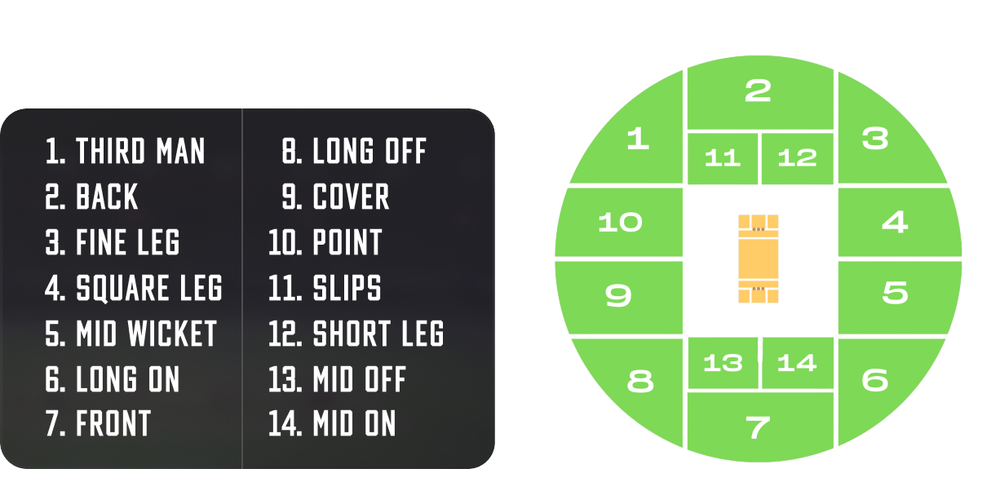

# Cryck: Transforming Fantasy Cricket

Welcome to our innovative Fantasy Cricket Blockchain Game, a cutting-edge project that integrates the excitement of fantasy cricket with the transformative power of decentralized finance (DeFi) and blockchain technology. Designed for the Core DAO's GameFi track, this game offers a unique blend of sports strategy and digital asset rewards, allowing players to engage with the sport in a completely new and immersive way.

## Technologies

- **React**: For a dynamic and responsive client-side application.
- **Hardhat**: A development environment for compiling, deploying, testing, and debugging Ethereum software.
- **Rainbow Connect:** User authentication is facilitated through Rainbow Connect, ensuring a seamless and secure login experience.
- **Wagmi Integration:** Wagmi provides seamless interaction between the frontend and the CoreDAO blockchain, enabling smooth gameplay and transactions.

## Key Features

- **Ball Prediction:** Users can predict the outcome of the next ball, choosing between a 4, 6, or wicket, along with the likely zone where the ball will land among 14 different zones on the field.

- **CrypkCoins (CRC):** The in-app currency, CRC, powers the platform's economy, with a conversion rate of 1000 CRC = 1 tCORE (CoreDAO testnet token).

## How to Play

1. **Sign Up:** Register with Cryck using Rainbow Connect authentication.
2. **Guess the Game:** Buy NFTs representing different parts of the cricket ground and predict the outcome of the next ball, boundary, or six.
3. **Earn Rewards:** Win cryptocurrency rewards for accurate predictions and participation in contests.
4. **Fair & Transparant:**  Enjoy transparency and fairness ensured by blockchain technology, providing a level playing field for all participants.

## Screenshots

<p float="left">
    
     
</p>
<p float="left">
    
     
</p>
<p float="left">
    
     
</p>

## Getting Started

To get started with Cryck, follow these steps to run the local server:

1. **Clone the Repository:** Clone the Cryck repository from GitHub to your local machine using the following command:

   ```bash
   git clone https://github.com/your-username/cryck.git
   ```

2. **Navigate to the Directory:** Move into the Cryck client project directory:

   ```bash
   cd Cryck/client
   ```

3. **Install Dependencies:** Install the necessary dependencies using npm or yarn:

   ```bash
   npm install
   ```

   or

   ```bash
   yarn install
   ```

4. **Configure Credentials:** Navigate to data.js and Add Your Credentials
- Locate the `data.js` file within the project.
- Replace the `SENDER_ADDRESS` and `PRIVATE_KEY` placeholders with your actual Ethereum address and private key.
  
5. **Start the Local Server:** Once the dependencies are installed, start the local server:

   ```bash
   npm run dev
   ```

6. **Access Cryck:** Open your web browser and navigate to `http://localhost:5173` to access the Cryck platform. You can now sign up or log in with Rainbow Connect to start predicting cricket outcomes and earning CrypkCoins (CRC). (NOTE: Replace 5173 with the port your dev environment is running)

## Deployment Note
> :warning: *MVP and Hackathon Stage*: This project has been deployed on the Core testnet for demonstration and testing purposes. Due to the MVP stage of development and the constraints of a hackathon timeline, we focused on showcasing the core functionalities without implementing a centralized backend. Such a backend would be required for real-time data synchronization and accurate blockchain updates, but developing this component was beyond our scope within the given time frame.

## Contributors

- Jeyasurya (@jeyasuryaur): Front-End Developer
- Jas Krrish (@jaskrrish): Front-End Developer
- Srinivas Joshi (@srinivasjoshi): Blockchain Developer
- Devam Savla (@devamsavla): Designer

